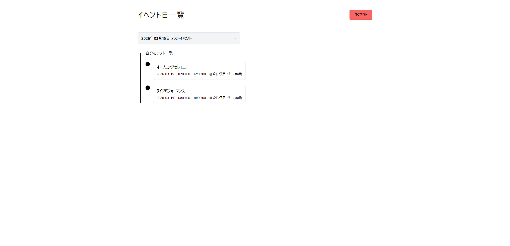
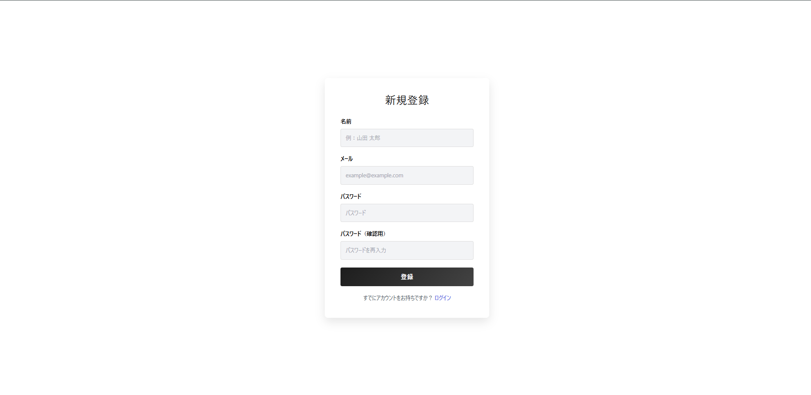

# Fes Schedule App

## 概要
Fes Schedule App は 大学のサークル活動を円滑にするために開発しました。Laravel によるサーバーサイドと Vite + React によるフロントエンドを組み合わせ、サークルメンバーが自分の割り当てられたイベント日ごとのシフトをタイムライン表示で確認できるスケジュールビューアーです。

- **バックエンド**: Laravel（Sanctum 認証）、`Event` / `EventDay` / `ScheduleItem` / `ScheduleAssignment` モデルと `/api/me/event-days` や `/api/events/{event}/my-shifts` を提供する API コントローラによって構成されています。
- **フロントエンド**: Vite + React + TypeScript（`fes-schedule-web/src` 配下）。`axios` ラッパーで認証済 API を叩き、イベント日選択＆タイムライン UI を構成しています。
- **データベース**: MySQL（`database/migrations` にテーブル定義）、ユーザー・イベント・シフト・割当を管理。`events` が複数の `event_days` を持ち、各 `event_day` が複数の `schedule_items` を有し、`schedule_assignments` で `users` と `schedule_items` を結び付ける多対多の割当構造になっています。
- **開発ツール**: Composer / npm、Laravel Artisan コマンド、（必要に応じて）Laravel Sail 準拠のシードとマイグレーション。
- **画面構成**
   
   
   

- **実装予定機能**
  - ユーザーに管理者権限を与えて、シフトを追加・削除できる機能
  - より見やすいUI設計

## DB設計

- **users**
  - id (PK)
  - name
  - email (unique)
  - password
  - student_number
  - created_at
  - updated_at

- **events**
  - id (PK)
  - name
  - created_at
  - updated_at

- **event_days**
  - id (PK)
  - event_id (FK → events.id)
  - date
  - label
  - created_at
  - updated_at

- **schedule_items**
  - id (PK)
  - event_day_id (FK → event_days.id)
  - start_time
  - end_time
  - title
  - description
  - location
  - type
  - manual_url
  - created_at
  - updated_at

- **schedule_assignments**
  - id (PK)
  - user_id (FK → users.id)
  - schedule_item_id (FK → schedule_items.id)
  - role
  - status
  - created_at
  - updated_at

## 実装状況
- **現在できていること**
  - ユーザー認証
  - イベント日の選択→その日のシフト一覧
  - ログアウト
  - 新規ユーザー登録
- **まだできていないところ**
  - 管理者用の画面（スケジュール調整）
-**なぜできていないか**
  - 時間
-**実装方針**
  - Laravel＋Reactがよく使われているので、それを基に、実際に使えるWEBアプリを開発しました。
  - 授業内の内容を復習し、AIを用いながら1行ごとに意味を確認して実装しました。

## プロジェクトの試し方
1. **バックエンド準備（リポジトリルート）**
   - `composer install` で PHP 依存関係を取得。
   - `.env.example` を `.env` にコピーし、MySQL などの `DB_*` を設定。`php artisan key:generate` を実行。
   - `php artisan migrate` でマイグレーションを適用し、必要なら `php artisan db:seed`（もしくは Sail 利用時は `php artisan sail artisan migrate --seed` など）でダミーデータ投入。
   - `php artisan serve` で Laravel 開発サーバを起動（デフォルト http://127.0.0.1:8000）。

2. **フロントエンド準備（fes-schedule-web）**
   - `npm install` で依存関係をインストール。
   - `npm run dev -- --port 5173` で Vite サーバを立ち上げ。Sanctum の CSRF クッキー取得を含む API 呼び出しを行う。

3. **認証と操作**
   - `http://localhost:5173/login` にアクセスしてメール／パスワードでログイン。
   - 「新規登録」リンクからユーザー登録ページへ移動し、登録完了後に `/event-days` へリダイレクト。
   - イベント日を選ぶと `/api/me/event-days` と `/api/events/{event}/my-shifts` が呼ばれ、タイムラインとマニュアルリンクが表示される。

4. **便利なコマンドと確認**
   - `php artisan tinker` で `App\Models\User::find` や `ScheduleAssignment` を調査可能。
   - `php seed-events.php` が存在する場合は実行してイベント/シフトを投入。
   - `config/cors.php` の `paths` や `allowed_origins` に `http://localhost:5173` (または Vite の実行ホスト) を含めて、フロントエンドからの資格情報付きリクエストを許可していることを確認。
   - フロントエンド側は `/sanctum/csrf-cookie` を投げた後にログイン/登録を行うため、Laravel サーバーが先に起動している必要があります。

5. **テストユーザー**
   - テストユーザー `test@example.com` / `password` でログイン・登録ページの動作確認ができます。

両方のサーバーを立ち上げた状態で、React 側の `/login`→`/register`→`/event-days` の流れをたどれば、自分のシフトタイムラインが表示されるはずです。
